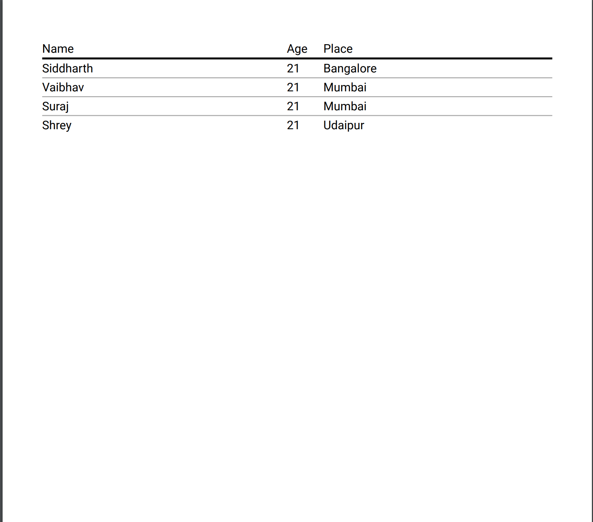

# Pdf-node-shrey

# To run the app after installing dependencies

1. cd into project directory
2. Type `yarn`to install project related dependencies
3. Type `yarn start` to start the app. Server will start on port 8080.
4. Go to http://localhost:8080/generate to generate the pdf with sample data.
5. Sample data is available in seed.js
6. The pdf will be generated in the pdf folder with a random filename.

# To run this app

1. Install node - Download the latest LTS version
2. Install yarn a package manager for node

# Your pdf with current sample data would appear this way

